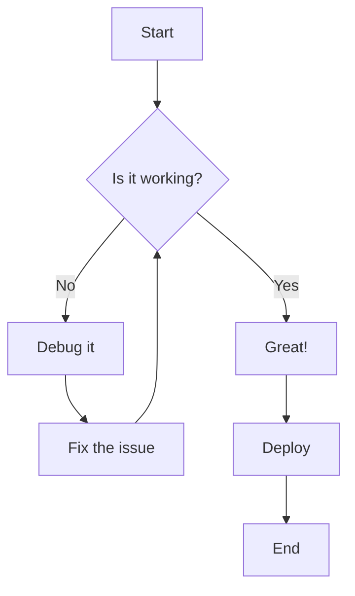
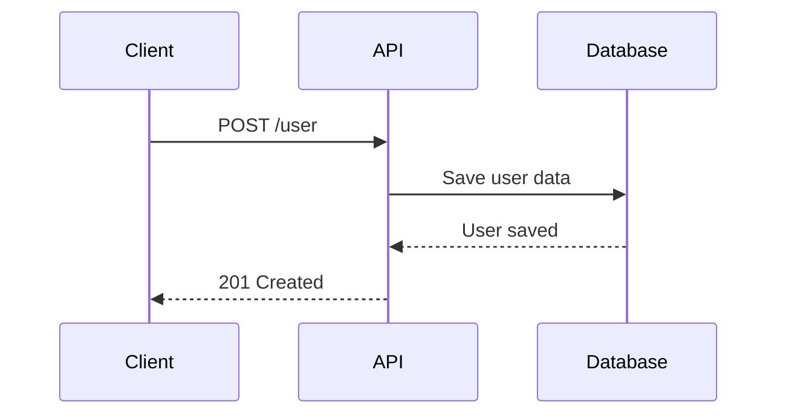
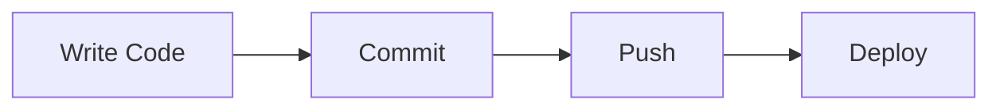

# Mermaid Diagrams Test

Testing different types of Mermaid diagrams using the standard markdown syntax.

## Flowchart

## Sequence Diagram

## Simple Graph

This approach uses the rehype-mermaid plugin to render diagrams at build time. 