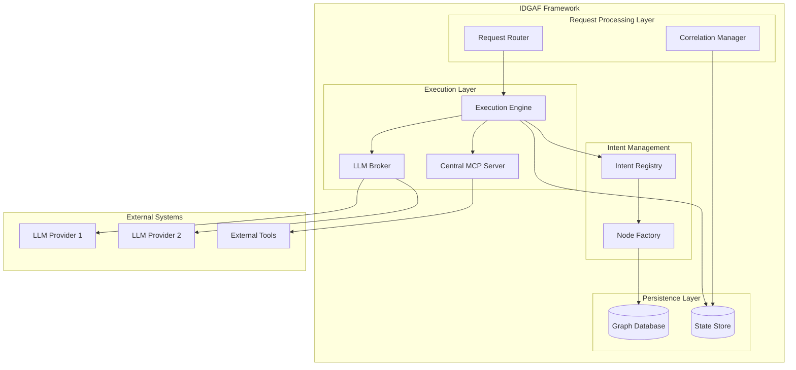
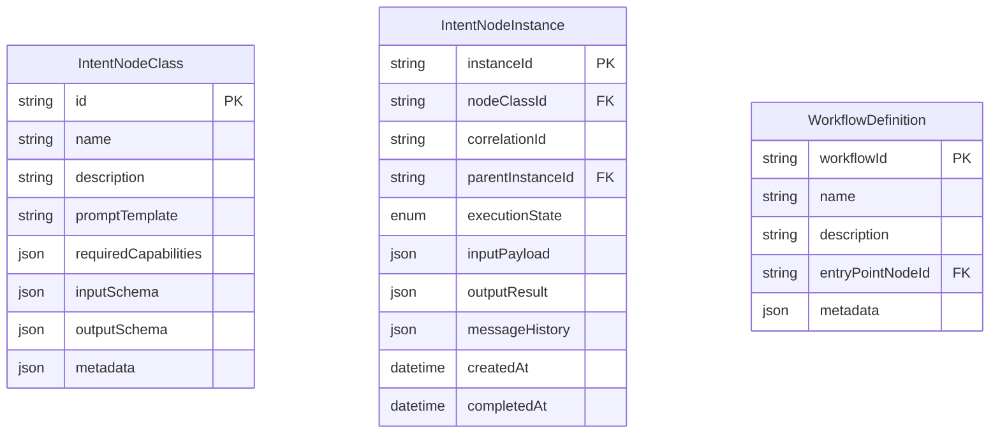
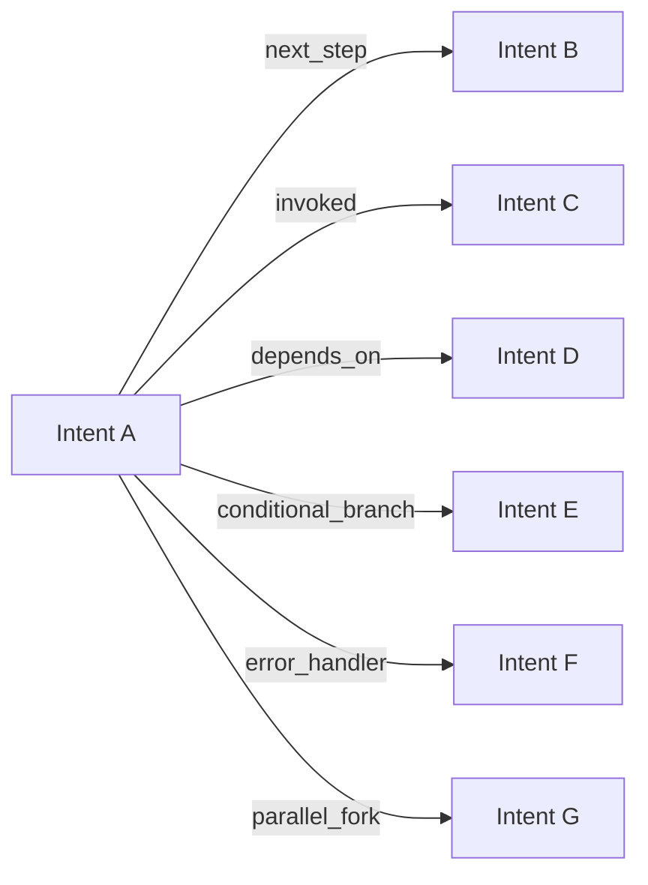
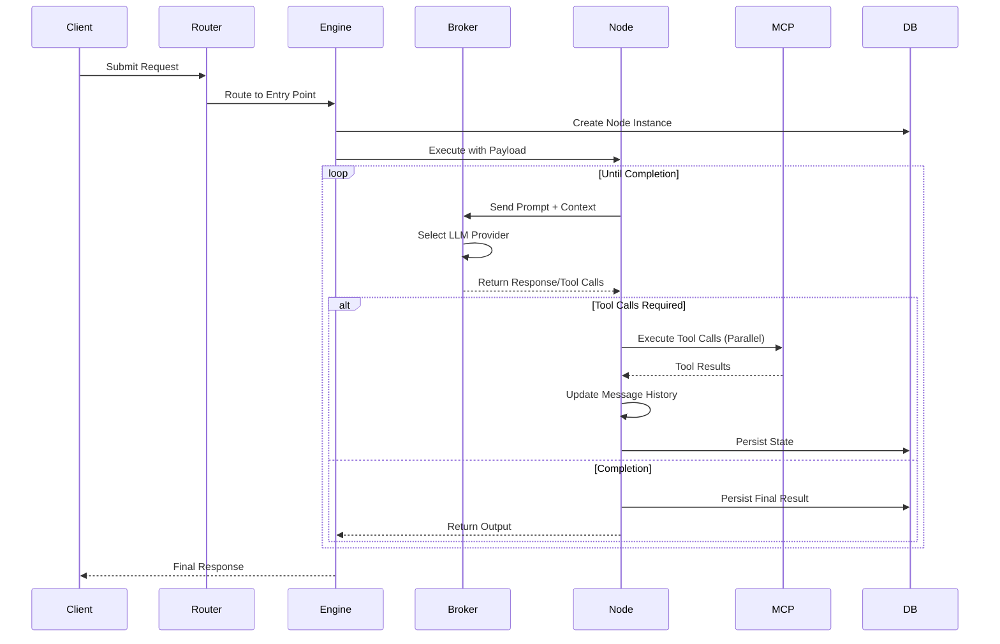
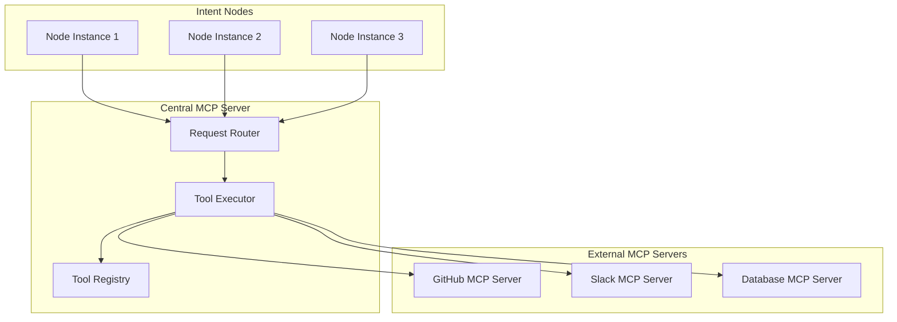
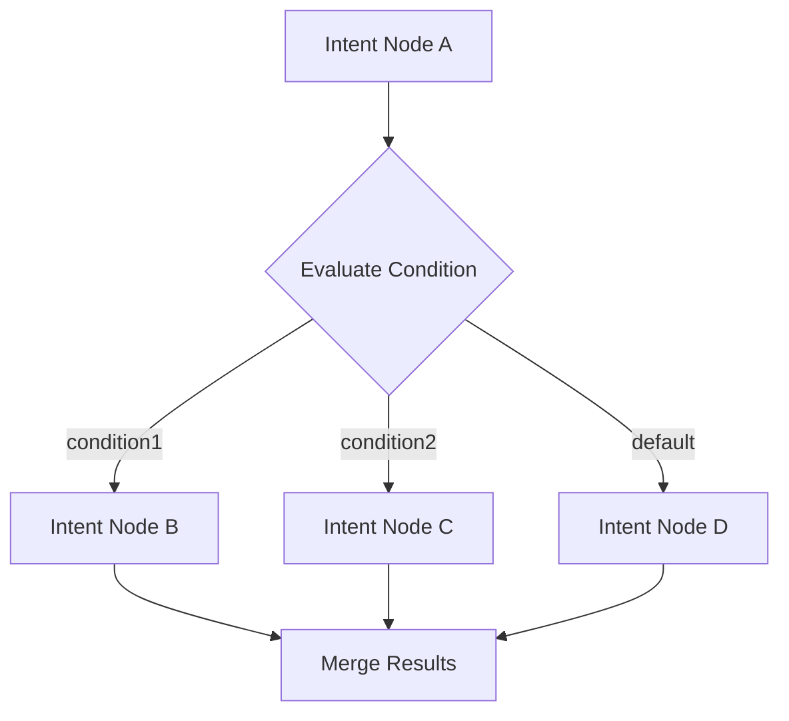
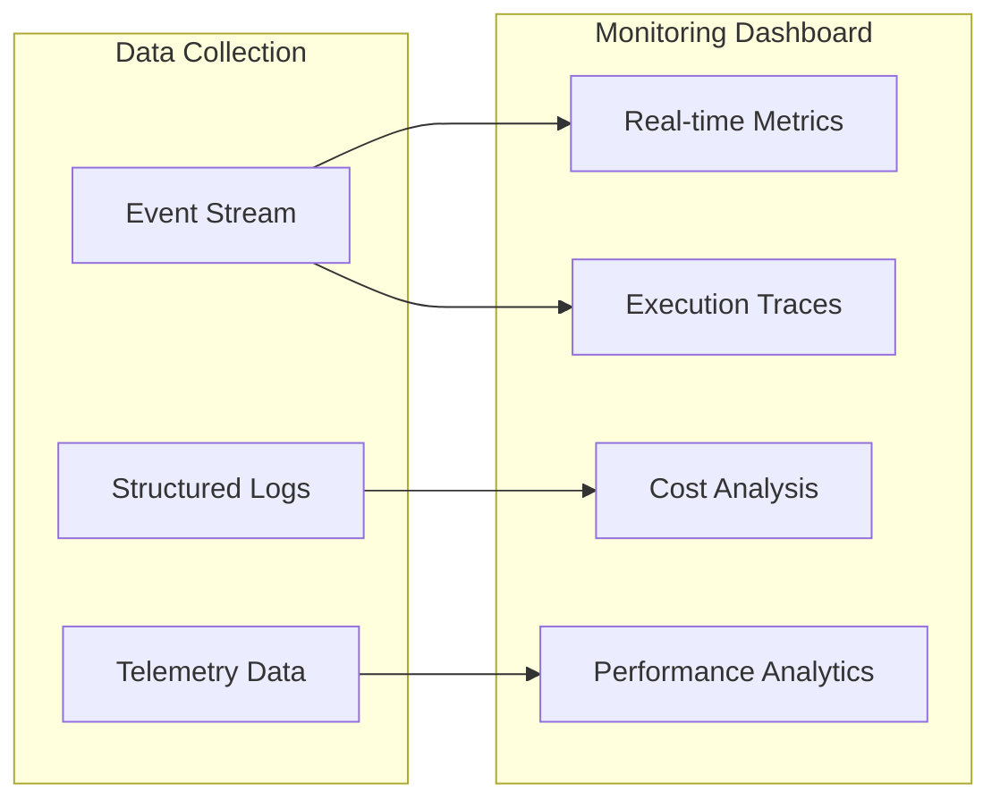

# Intent-Driven Gen-AI Autonomous Framework (IDGAF)
## Technical Architecture Specification

### Executive Summary

The Intent-Driven Gen-AI Autonomous Framework (IDGAF) is a novel software engineering paradigm that shifts from deterministic programming to intent-based autonomous execution. Instead of writing explicit control flow, developers define **Intent Nodes** with natural language prompts and business logic, allowing Gen-AI systems to orchestrate execution through a graph-based workflow engine.

The framework provides approximately 80% autonomy to Gen-AI systems while maintaining developer control over business logic through intent definitions and directed acyclic graph (DAG) constraints.

---

## Core Architecture

### High-Level System Design



---

## Core Components

### 1. Intent Node Architecture

#### Intent Node Class Definition

```typescript
interface IntentNodeClass {
  id: string;
  name: string;
  description: string;
  promptTemplate: string;
  requiredCapabilities: MCPCapability[];
  inputSchema: JSONSchema;
  outputSchema: JSONSchema;
  metadata: {
    tags: string[];
    version: string;
    author: string;
  };
}
```

#### Intent Node Instance

```typescript
interface IntentNodeInstance {
  instanceId: string;
  nodeClassId: string;
  correlationId: string;
  parentInstanceId?: string;
  executionState: ExecutionState;
  inputPayload: any;
  outputResult?: any;
  messageHistory: Message[];
  createdAt: Date;
  completedAt?: Date;
}

enum ExecutionState {
  PENDING = "pending",
  RUNNING = "running", 
  WAITING_FOR_TOOLS = "waiting_for_tools",
  COMPLETED = "completed",
  FAILED = "failed"
}
```

### 2. Graph Data Model

#### Node Types


#### Edge Types


**Edge Types:**
- `next_step`: Sequential workflow progression
- `invoked`: Runtime tool call spawning
- `depends_on`: Prerequisite relationships
- `conditional_branch`: State-based routing
- `error_handler`: Exception handling paths
- `parallel_fork`: Concurrent execution branches

### 3. Request Processing Flow



### 4. LLM Broker Architecture

The LLM Broker provides provider-agnostic LLM access with intelligent routing:

```typescript
interface LLMBrokerConfig {
  providers: LLMProvider[];
  routingStrategy: RoutingStrategy;
  fallbackChain: string[];
}

interface LLMProvider {
  id: string;
  name: string;
  endpoint: string;
  capabilities: string[];
  costPerToken: number;
  maxTokens: number;
  supportsTools: boolean;
}

enum RoutingStrategy {
  COST_OPTIMIZED = "cost_optimized",
  PERFORMANCE_OPTIMIZED = "performance_optimized", 
  CAPABILITY_MATCHED = "capability_matched",
  ROUND_ROBIN = "round_robin"
}
```

### 5. Model Context Protocol Integration

#### Central MCP Server Architecture



#### Tool Registration Process

```typescript
interface MCPToolDefinition {
  name: string;
  description: string;
  inputSchema: JSONSchema;
  outputSchema: JSONSchema;
  nodeClassId?: string; // For internal node tools
  externalServerId?: string; // For external MCP servers
}

// Internal nodes can be registered as MCP tools
class IntentNodeMCPAdapter {
  registerNodeAsTool(nodeClass: IntentNodeClass): MCPToolDefinition {
    return {
      name: `invoke_${nodeClass.name}`,
      description: nodeClass.description,
      inputSchema: nodeClass.inputSchema,
      outputSchema: nodeClass.outputSchema,
      nodeClassId: nodeClass.id
    };
  }
}
```

---

## Dynamic Execution Model

### 1. Prompt Template Rendering

Intent nodes use dynamic prompt rendering based on request context:

```typescript
interface PromptContext {
  requestPayload: any;
  nodeInput: any;
  parentContext?: any;
  availableTools: MCPToolDefinition[];
  correlationId: string;
}

class PromptRenderer {
  renderPrompt(template: string, context: PromptContext): string {
    // Template variables: {{requestPayload.field}}, {{nodeInput.data}}, etc.
    // Dynamic tool injection based on available capabilities
    // Context-aware prompt construction
  }
}
```

### 2. State Management and Inheritance

```typescript
interface ExecutionContext {
  correlationId: string;
  requestPayload: any;
  sharedState: Map<string, any>;
  parentOutput?: any;
  depth: number;
}

class StateManager {
  createChildContext(parent: ExecutionContext, nodeInput: any): ExecutionContext {
    return {
      correlationId: parent.correlationId,
      requestPayload: parent.requestPayload,
      sharedState: new Map(parent.sharedState), // Inherited
      parentOutput: nodeInput,
      depth: parent.depth + 1
    };
  }
}
```

### 3. Conditional Branching Logic



Conditions can be evaluated based on:
- Request payload values
- Previous node outputs
- External system state
- LLM-determined routing

---

## Traceability and Monitoring

### 1. Correlation Tracking

```typescript
interface CorrelationTrace {
  correlationId: string;
  rootRequestId: string;
  executionPath: {
    nodeInstanceId: string;
    nodeClassId: string;
    startTime: Date;
    endTime?: Date;
    status: ExecutionState;
    input: any;
    output?: any;
    toolCallCount: number;
    llmTokensUsed: number;
  }[];
  totalDuration?: number;
  totalCost?: number;
}
```

### 2. Execution Monitoring



---

## Database Schema Design

### Graph Database Implementation (Neo4j/PostgreSQL)

```sql
-- Node Classes (Intent Definitions)
CREATE TABLE intent_node_classes (
    id UUID PRIMARY KEY,
    name VARCHAR(255) NOT NULL,
    description TEXT,
    prompt_template TEXT NOT NULL,
    required_capabilities JSONB,
    input_schema JSONB,
    output_schema JSONB,
    metadata JSONB,
    created_at TIMESTAMP DEFAULT NOW(),
    updated_at TIMESTAMP DEFAULT NOW()
);

-- Node Instances (Executions)
CREATE TABLE intent_node_instances (
    instance_id UUID PRIMARY KEY,
    node_class_id UUID REFERENCES intent_node_classes(id),
    correlation_id UUID NOT NULL,
    parent_instance_id UUID REFERENCES intent_node_instances(instance_id),
    execution_state VARCHAR(50) NOT NULL,
    input_payload JSONB,
    output_result JSONB,
    message_history JSONB,
    created_at TIMESTAMP DEFAULT NOW(),
    completed_at TIMESTAMP,
    INDEX(correlation_id),
    INDEX(node_class_id),
    INDEX(execution_state)
);

-- Workflow Edges
CREATE TABLE workflow_edges (
    id UUID PRIMARY KEY,
    from_node_class_id UUID REFERENCES intent_node_classes(id),
    to_node_class_id UUID REFERENCES intent_node_classes(id),
    edge_type VARCHAR(50) NOT NULL,
    condition_expression TEXT,
    weight INTEGER DEFAULT 1,
    metadata JSONB
);

-- Execution Traces
CREATE TABLE execution_traces (
    trace_id UUID PRIMARY KEY,
    correlation_id UUID NOT NULL,
    node_instance_id UUID REFERENCES intent_node_instances(instance_id),
    event_type VARCHAR(50) NOT NULL,
    event_data JSONB,
    timestamp TIMESTAMP DEFAULT NOW(),
    INDEX(correlation_id),
    INDEX(node_instance_id)
);
```

---

## Implementation Roadmap

### Phase 1: Core Framework
1. **Intent Node Engine** - Basic node definition and execution
2. **Graph Database Integration** - PostgreSQL with graph extensions
3. **Simple LLM Broker** - Single provider integration
4. **Basic MCP Server** - Tool registry and routing

### Phase 2: Advanced Features  
1. **Multi-LLM Support** - Provider abstraction and routing
2. **Conditional Branching** - State-based workflow control
3. **Advanced Traceability** - Comprehensive monitoring
4. **External MCP Integration** - Third-party tool ecosystem

### Phase 3: Production Features
1. **Horizontal Scaling** - Distributed execution engine
2. **Advanced Analytics** - Performance optimization
3. **Security Framework** - Authentication and authorization
4. **Developer Tooling** - IDE extensions and debugging tools

---

## Security Considerations

### 1. Intent Isolation
- Each node instance runs in isolated execution context
- Input/output validation using JSON schemas
- Resource limits and timeout enforcement

### 2. Tool Access Control
```typescript
interface ToolPermissions {
  nodeClassId: string;
  allowedTools: string[];
  resourceLimits: {
    maxTokens: number;
    maxExecutionTime: number;
    maxToolCalls: number;
  };
}
```

### 3. Data Privacy
- Encryption at rest for sensitive payloads
- PII detection and redaction in logs
- Audit trails for compliance

---

## Example Usage

### Defining an Intent Node Class

```typescript
const customerSupportIntent: IntentNodeClass = {
  id: "customer-support-classifier",
  name: "Customer Support Classifier",
  description: "Analyzes customer inquiries and routes to appropriate handlers",
  promptTemplate: `
    You are a customer support classifier. Analyze this customer inquiry:
    
    Customer Message: {{requestPayload.message}}
    Customer Info: {{requestPayload.customerInfo}}
    
    Available tools for routing:
    {{#each availableTools}}
    - {{name}}: {{description}}
    {{/each}}
    
    Classify the inquiry and route appropriately.
  `,
  requiredCapabilities: [
    { type: "tool", name: "route_to_billing" },
    { type: "tool", name: "route_to_technical" },
    { type: "tool", name: "escalate_to_human" }
  ],
  inputSchema: {
    type: "object",
    properties: {
      message: { type: "string" },
      customerInfo: { type: "object" }
    }
  },
  outputSchema: {
    type: "object", 
    properties: {
      classification: { type: "string" },
      confidence: { type: "number" },
      routingDecision: { type: "string" }
    }
  }
};
```

### Creating a Workflow

```typescript
const supportWorkflow = {
  entryPoint: "customer-support-classifier",
  edges: [
    {
      from: "customer-support-classifier",
      to: "billing-handler",
      type: "conditional_branch",
      condition: "output.classification === 'billing'"
    },
    {
      from: "customer-support-classifier", 
      to: "technical-handler",
      type: "conditional_branch",
      condition: "output.classification === 'technical'"
    }
  ]
};
```

---

## Conclusion

The Intent-Driven Gen-AI Autonomous Framework represents a paradigm shift from deterministic programming to intent-based autonomous execution. By leveraging Gen-AI agency within structured constraints, developers can build more adaptive and intelligent systems while maintaining control over business logic and outcomes.

The framework's graph-based architecture, combined with standardized MCP integration, provides a scalable foundation for building the next generation of AI-powered applications. 